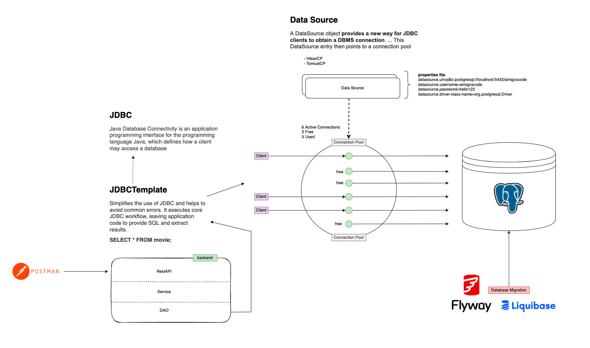

# Template para usar jdbcTemplate con HikariCp

# Diagram


# Exercise
- Add the ability to edit movies
- Add `actor` table and associate them with movies
  You will need to create a new migration called: `V1__ActorTable.sql` and the following sql to create the actor table

```sql
CREATE TABLE actor
(
    id    bigserial primary key,
    name  TEXT NOT NULL,
    movie bigint REFERENCES movie (id),
    unique (name, movie)
);
```

- Hikari
- Flyway (para crear versionado de bases de datos):
En lugar de tener un file grande con todo mi SQL , puedo versionar los cambios.
- Ver de respetar el nombre de las carpetas para que funcione.
- Las tablas se crean solas cuando arranca la app (pero 1ero hay que crear la bd a mano).


```xml
<dependency>
    <groupId>org.flywaydb</groupId>
    <artifactId>flyway-core</artifactId>
</dependency>
```


. Jdbc: Como me conecto a la DB usando JDBC, y Jdbc Template me permite simplificar 
el uso de JDBC, errores de conexion, me deja proveer sql y extraer los resultados.

. HIKARI: Supuestamente es el mas rapido de los jdbc handler


Este es el Wrapper JDBC
```xml
		<dependency>
			<groupId>org.springframework.boot</groupId>
			<artifactId>spring-boot-starter-data-jdbc</artifactId>
		</dependency>
```

Probar curl con lista de objetos de Actores
```json
POST http://localhost:8080/api/v1/movies/add
Content-Type: application/json

{
  "id": "10",
  "name": "peli nueva7",
  "releaseDate": "2021-09-21",
  "actors":[{"id":"2","name":"matrix2", "movieId":  "10"}]
}
```

docker build -t movies . 
docker compose up -d